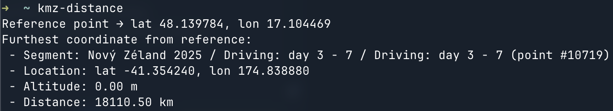

# kmz-distance

Calculate the furthest point from a path defined in a KMZ file (such as Google Maps export)

I created this tool to calculate the furthest point from my hometown Bratislava during my New Zealand travels in November 2025. New Zealand is the nearest land to my city's [antipode](https://en.wikipedia.org/wiki/Antipodes), which actually lies in the Pacific Ocean. Unless I travel to some more eastern islands, such as Chatham Island, or to space, I will never be further away from home than this.

> [!NOTE]
> Created with OpenAI's **Codex CLI** and **gpt-5-codex** model.



## Usage

```text
USAGE
  kmz-distance [--kmz path] [--ref lat,lon] [--verbose] [<kmz>] [<lat,lon>]
  kmz-distance --help

Calculate furthest distance between KMZ route and reference point.

FLAGS
  -k [--kmz]                  Path to the KMZ archive to analyze.
  -r [--ref]                  Reference point in "lat,lon" format.
  -v [--verbose]  Print per-segment and per-point details.
  -h  --help                  Print help information and exit

ARGUMENTS
  [kmz]      KMZ archive path.
  [lat,lon]  Reference point as "lat,lon".
```

## How It Works

- Unzips the KMZ archive with `adm-zip` to access the bundled `doc.kml` payload.
- Parses placemarks and route coordinates via `xml2js`, normalizing them into segment arrays.
- Applies a [Haversine distance](https://en.wikipedia.org/wiki/Haversine_formula) calculation against the chosen reference point to surface the furthest location.
